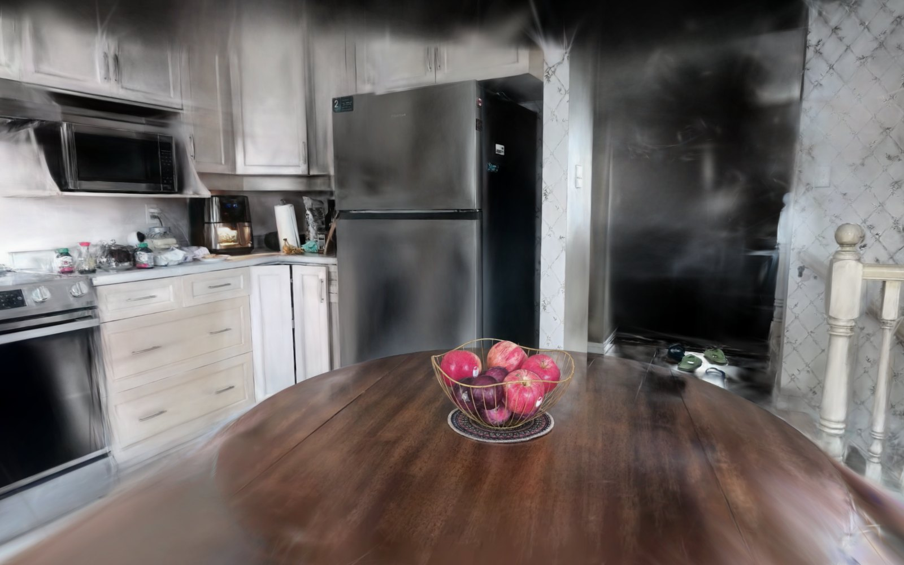

# Fruit Bowl

**A bowl of fruit on a kitchen table, captured with a phone and rebuilt as a 3D
scene you can fly a camera through in the browser.**

### → [gaussian-splat-render.vercel.app](https://gaussian-splat-render.vercel.app)

No mesh. No textures. No lighting. What you're looking at is **1.8 million
translucent 3D ellipsoids** — "Gaussian splats" — each with its own position,
size, orientation, colour and opacity, blended back-to-front. The appearance is
baked in, which is why it reads as photographic rather than rendered.

---

## Two views

Switch between them in the top-left.

**Bowl only** — the subject on black, 260,403 splats, 4.9 MB.

**Full room** — the whole kitchen it was captured in, 1,605,739 splats, 22 MB.

That second image is the part worth dwelling on. Nothing in it was modelled.
It's an inference from 250 handheld photographs about where several million
translucent blobs had to sit in space for those photographs to be what they are.

---

## From phone to browser

| | |
|---|---|
| Source | 3.5 minutes of handheld 1080p video, 12,581 frames, 508 MB |
| Frames used | 250, auto-selected for sharpness |
| Camera solve | **250 / 250** registered, 0.68 px mean reprojection error |
| Training | 61 minutes on an M-series GPU |
| Result | 1,806,414 splats, 407 MB |
| **Shipped** | **4.9 MB** — 83x smaller |

Nothing here was measured or modelled by hand. The camera positions were
recovered from the footage itself by structure-from-motion: given 250 photos and
no other information, solve simultaneously for where every camera was and where
several hundred thousand 3D points are. Those poses then seed an optimiser that
spends an hour asking, 30,000 times, *"render the splats from this angle — how
wrong is it?"* and nudging 107 million parameters toward the answer.

---

## What turned out to be hard

**Not what I expected.** Going in, the obvious risks were the thin gold wire
(sub-pixel, specular) and the large glossy tabletop (nearly textureless, with
reflections that slide as the camera moves). Both reconstructed cleanly. With
250 well-registered views there was enough signal to resolve them — you can read
the produce stickers and the pattern on the doily.

**What actually cost time was the coordinate system.** Structure-from-motion has
no gravity reference. It defines world axes from the first pair of images it
registers, so the scene arrives tilted at whatever angle the phone happened to be
held, with +Y pointing down and no notion of scale. Nothing downstream fixes it.

True vertical was recovered by measuring it two independent ways and checking
they agreed: a RANSAC plane fit to the tabletop (which is horizontal in reality)
and the normal of the plane through all 250 camera positions (the capture orbited
roughly level). They landed **1.6 degrees apart**, which is what made the number
trustworthy.

**And one honest failure.** The room view originally used a crop radius that
removed 49% of the scene. It looked fine head-on and left gaping black holes the
moment you orbited — the kitchen walls sat just outside the crop. Black in a
splat render means no splats, either cropped away or never seen by any camera.
Verifying from one flattering angle is not verifying.

---

## Built with

[COLMAP](https://colmap.github.io/) for structure-from-motion ·
[Brush](https://github.com/ArthurBrussee/brush) for training (Rust + wgpu, so it
runs on Metal) · [splat-transform](https://github.com/playcanvas/splat-transform)
for compression to `.sog` ·
[Spark](https://github.com/sparkjsdev/spark) + [three.js](https://threejs.org/)
for rendering · deployed on Vercel as a static page with no build step.

Frame selection is a small script that scores every frame by variance of the
Laplacian and keeps the sharpest one per time window — even coverage of the
camera path *and* sharp frames, which you can't get by sampling at a fixed rate.

---

## Going deeper

**[docs/PIPELINE.md](docs/PIPELINE.md)** is the full technical walkthrough: how
structure-from-motion and 3DGS training actually work, how to read a
reconstruction's quality metrics before committing an hour to training, what's
inside a `.sog` file, the coordinate-system pitfalls, and every mistake made
building this along with what it teaches.
